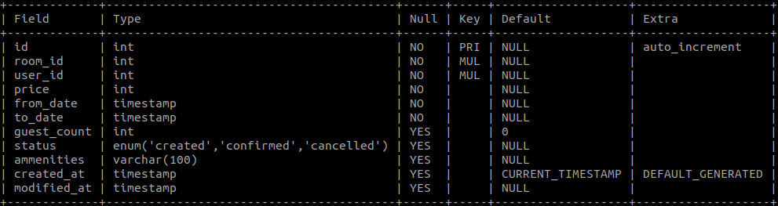
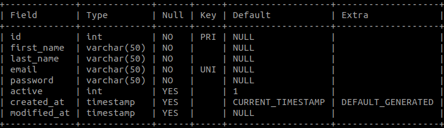
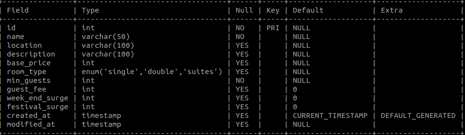

# FINAL PROJECT ON HOTEL BOOKING APPLICATION

## Team Name:

Team 08 JusticeLeague

## Team Members:

<li> Aishwarya Paruchuri ( SJSU ID: 015017639)
<li> Anay Dilip Naik( SJSU ID: 015217358 )
<li> Achal Rajyaguru ( SJSU ID: 015958670 )
<li> Supreet Chandrasekhar ( SJSU ID:015919566 )</li>
 

## Team Members Task Distribution:

<li> Frontend : Aishwarya Paruchuri, Achal Rajyaguru
<li> Backend : Anay Dilip Naik, Supreeth Chandrasekhar
<li> Deployment : Anay Dilip Naik, Supreeth Chandrasekhar
<li> Documentation : Aishwarya Paruchuri, Achal Rajyaguru</li>
 

## Sprint Meeting:

Every Friday 

## Project board:

### Project Journal: https://github.com/gopinathsjsu/team-project-justiceleague/blob/main/Project_Journal.pdf
### Project Sprint task board : https://github.com/gopinathsjsu/team-project-justiceleague/blob/main/Weekly%20Scrum%20Task%20Board.pdf
### Project Task Board:

  
 ## UI Wireframes

## Technology Stack

<li> Frontend: ReactJS
<li> Backend: NodeJS and ExpressJS
<li> Database: MySQL
<li> Deployment: AWS EC2 </li>

## XP Values Implemented

<li> Communication: During these tough times, in which meeting in person is not well suited we still were able to get
things done by communicating through online video conferencing platforms and we all have been
"Communicating" and Collaborating through Whatsapp and Zoom conversations pertaining to the project
discussion.
<li> Feedback: We believe in feedback. We have given valuable feedback to the team to create a better product.
After every development item is completed, the team gave feedback on the delivered item for
changes/suggestions.
<li> Respect: In every discussion, be it about tech stack, database design or project level discussions, we
acknowledged each others' unique ideas and individual viewpoints and came to a common consensus. All the
team members were empathetic towards others in resolving challenges. Hencé, We distributed responsibilities
such that everyone gets to learn everything and restrict one person to solely one aspect of programming
<li> Simplicity: The team was always working towards delivering products with absolutely necessary features though
which we were able to omit unnecessary development items. Even in terms of UI development, we maintained a
simple and elegant design that is easier to maintain and revise.</li>

## Tools

<li> Frontend: Visual Studio Code,Atom,AdobeXD,Zeplin,Git
<li> Backend: Robo3T, Postman, Visual Studio, Sublime </li>

## Steps to Run the Project

1. Open your terminal and clone this github repo
2. Open the cloned folder and delete the node modules and package-lock.json file
3. Type npm install
4. Type npm i
5. Type npm start

## Features Integerated

### Customer

<li> can register for the hotel
<li>can login for the hotel
<li>search for hotel rooms from chains of the hotel
<li>can create a reservation
<li>can update the hotel
<li>can see promo codes available for season
<li>can filter according to needs
<li>can select froma  set of amanities available in the hotel
<li>can update the reservation
<li>can checkout of the hotel room
<li>confirm booking and select a payment method
<li>can select a checkin and checkout date
<li>can select a type of hotel room from all the available rooms

### Admin
<li>can check the profile of all the people who booked the hotel
<li>can edit the hotel room features
<li>can add more bookings
<li>can checkout users
<li>can change the staying period of a customer
<li>can add images and more features to each room
<li>can logout of the admin module
<li>can add rooms in different location of the hotel chain
    
  ## Deployment Diagram
  
  
  ## Use Case Diagram
  
  
  ## Activity Diagram
  
  
  ## State Diagram
  
  
  ## Architecture Diagram
  
  
  ## Class Diagram
  
  [Class Diagram.pdf](https://github.com/gopinathsjsu/team-project-justiceleague/files/8684385/Class.Diagram.pdf)

  ## Database Schemas
  
  
  
  
  ## Application Screenshots
  
  

